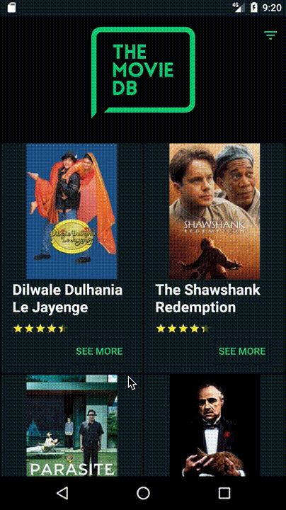

# Infinite recyclerview pulling movies from TMDb

* [Realm](https://realm.io/blog/realm-for-android/) - Persistence layer
* [Dagger2](https://github.com/google/dagger) - Dependency Injector
* [Retrofit2](https://square.github.io/retrofit/) - Rest api
* [Glide](https://github.com/bumptech/glide) - Image loading

## Tests
* [Espresso](https://developer.android.com/training/testing/espresso) - Android UI tests
* [Mockito](https://site.mockito.org/) - Mocking framework

## CI
* [Circleci](https://circleci.com/) - Continuous integration

Four hours implementation demo

